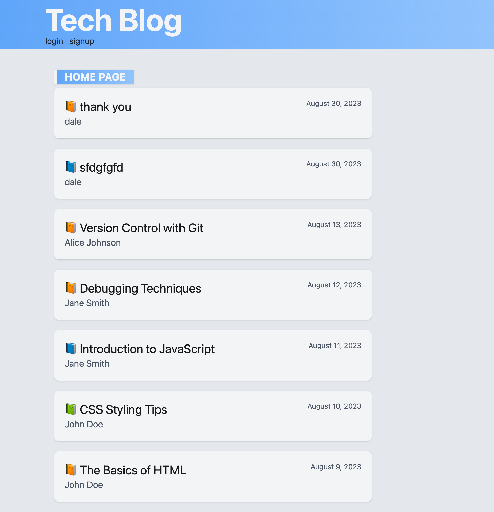

# Tech Blog

## Description 

---

A web application where users can create a profile and write blog posts about web development and comment on other user's posts. I wanted to create an application that would both be useful to other beginner coders share what they have learned to the community at large, as well as practice writing out a MVC application. In order to buid an MVC application I created a database that would be linked with controllers in the server-side code with models that would then manipulate the viewer on the client-side. This application allows for many different users to keep track of their own posts while still being able to see other This project really taught me a lot about the nature of MVC applications and just how to really use routes to connect to databases.

## Table of Contents

---

- [Usage](#usage)
- [Contributors](#contributors)
- [Links](#links)

        
## Usage 

---
    
Once the user arrives to the homepage they are met with the stream of blog posts. The user can open and read blogposts while they are logged out. If a user would like to write their own post or leave a comment, they must first log in (or sign up and then log in if they do not have an existing account) by navigating to the log in page with the navigation bar. Once logged in, the user will now have access to the dashboard. The dashboard is where all of their personal blogs are displayed and where they can write a new blogpost.
   

## Contributors

This project would not have been possible and I would not have gained such a great deal of knowledge on the subject material if it wasn't for the support of the course's teahing staff and tutors.

- Joem Casusi
- John Dinsmore
- Eric Graves
- Brittani Court

---

## Links 

---

[Heroku Live Page](https://young-citadel-01955-d8007dfcc929.herokuapp.com/ "Heroku Live Page")

[GitHub Repo](https://github.com/alfaro-matttthew/tech-blog "GitHub Repo")

